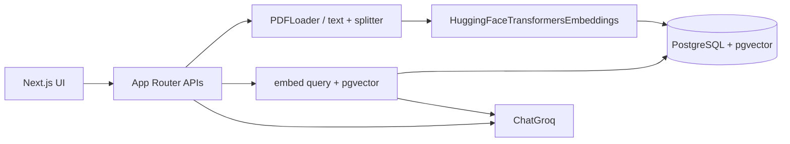

# Career Intelligence Assistant

MVP that compares **one resume** against **up to four job descriptions** using RAG.

Upload files, ask about fit / skill gaps / interview prep, or rank jobs with Best Match. Retrieved resume + job chunks are sent to Groq; the model must answer from that evidence only.

## Quick start

Prerequisites: Node.js 20+, npm, Docker Compose.

```bash
cp .env.example .env          # set GROQ_API_KEY for Analyze / Best Match
docker compose up -d
npm install
npm run db:migrate
npm run dev                   # http://localhost:3000
```

Retrieval and embeddings work without Groq. Generation needs `GROQ_API_KEY`.

```bash
npm run eval:retrieval        # seeds a golden corpus, then clears it
```

## How it works



1. **Upload** — parse PDF/text, split with `RecursiveCharacterTextSplitter` (900/120), embed with local `Xenova/all-MiniLM-L6-v2`, store in Postgres.
2. **Ask** — embed the question, cosine-search resume chunks plus the selected job (or all jobs), then `ChatGroq` returns JSON. Citations come from retrieved chunks, not from the model.
3. **Best Match** — same retrieve + generate per job; TypeScript applies fixed weights (technical 40%, experience 30%, domain 20%, seniority 10%).

## Why these libraries

| Piece | Library | Why |
|---|---|---|
| PDF / text load | LangChain `PDFLoader` | No custom PDF parser |
| Chunking | `RecursiveCharacterTextSplitter` | Paragraph/line splits with overlap |
| Embeddings | `HuggingFaceTransformersEmbeddings` | Local 384-d MiniLM, no embedding API |
| Vectors | PostgreSQL + pgvector | Job slots, FKs, and `<=>` cosine search in one DB |
| LLM | `ChatGroq` (`openai/gpt-oss-120b`) | Fast hosted generation, JSON mode |

Job filters run in the same SQL as vector search so a Job 2 question cannot return Job 1 chunks.

## Project layout

```
src/app/api                 HTTP routes
src/components              CareerWorkspace + workspace/* UI pieces
src/rag                     ingest + embed
src/generation              ChatGroq, prompts, JSON parse
src/services                upload, retrieve, analyze, best match
src/db                      pool.ts, queries.ts, migrations/
evaluation/                 golden questions + retrieval metrics
```

## Evaluation

`npm run eval:retrieval` uploads a fixed resume + 4 jobs, runs 10 questions through the real retriever, then deletes that data.

Last recorded baseline (character chunking 900/120, MiniLM, top-5):

| Metric | Value |
|---|---|
| Precision@5 | 0.640 |
| Recall@5 | 1.000 |
| Concept hit rate | 1.000 |
| Specific-job filter accuracy | 1.000 |
| All-Jobs coverage | 1.000 |

This is a small MVP check (binary relevance by document type + job id, keyword concept hits). It is not a production benchmark. Generation quality is not scored.

## Out of scope

Auth, multi-user, object storage, hybrid search, reranking, HNSW, streaming, unit test suite.
