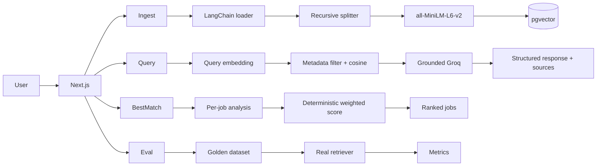

# Career Intelligence Assistant

Local Next.js + TypeScript prototype that compares **one resume** against **up to four job descriptions** using RAG. A candidate asks about fit, skill gaps, and interview prep, or ranks uploaded jobs with Best Match.

Sending full documents to an LLM mixes sources and invites invented experience. This app retrieves a small set of resume + selected-JD chunks first, then asks Groq to answer only from that evidence.

Single-user local prototype. No auth, streaming, hybrid search, reranking, or Ragas.

## 1. Problem & Solution

Career-fit questions are comparisons: what the candidate has done versus what a specific role requires. Job 2’s answer must not use Job 1’s requirements, and claims need citations.

The app stores chunked embeddings in PostgreSQL/pgvector, filters retrieval to resume + the selected job (or all jobs), and generates a structured analysis with sources taken from retrieved chunks — not from the model.

## 2. Quick Setup

Prerequisites: Node.js 20+, npm, Docker Compose.

```bash
cp .env.example .env          # set GROQ_API_KEY (required for Analyze / Best Match)
docker compose up -d
npm install
npm run db:migrate
npm run dev                   # http://localhost:3000
```

`GROQ_API_KEY` is required for generation. Retrieval, embeddings, and evaluation run without it.

```bash
npm test
npm run eval:retrieval
```

## 3. Architecture



UI calls API routes only. Routes call services. Repositories own SQL. Evaluation lives outside the app and is never imported by production code.

## 4. RAG / LLM Approach

| Component | Choice | Why |
|---|---|---|
| Orchestration | LangChain JS (loaders + splitter only) | Standard `Document` shape and PDF/text loaders without a custom parser |
| Chunking | `RecursiveCharacterTextSplitter` 900/120 | Splits on paragraphs/lines/words before characters; overlap keeps boundary context |
| Embeddings | `Xenova/all-MiniLM-L6-v2` (384-d, local) | No embedding API, on-device resume/JD text, matches `vector(384)` |
| Vector store | PostgreSQL + pgvector | Job slots, FKs, and vectors in one database |
| Similarity | Cosine distance `<=>` in SQL | MiniLM emits unit vectors; ranking stays in Postgres |
| LLM | Groq `llama-3.3-70b-versatile` | Fast hosted Llama; thin `fetch` client, replaceable provider |

**Chunking.** 900/120 is an experimental baseline (character budget, not tokens), not an optimum. Smaller chunks isolate one skill; larger chunks keep context but mix requirements.

**Retrieval.** Always resume chunks plus the selected job, or all JDs. Filters run in the same SQL as vector search so a Job 2 query cannot return Job 1.

**Generation.** The prompt may use only retrieved evidence, must not invent experience, must say “insufficient evidence” when unsupported, and must not treat a missed retrieval as proof a skill is absent. Output is validated JSON. Sources (`filename`, type, job, chunk index, similarity) are attached from retrieval, not from the LLM.

**Observability.** Server-side JSON logs for ingest, embed, retrieve, generate, and best-match (durations, `queryId`, chunk ids, scores). No document text, prompts, answers, or API keys.

## 5. Key Technical Decisions

**pgvector vs Chroma.** Four job slots, cascade deletes, and “resume + Job 2” filters are relational. pgvector keeps vectors next to that metadata. Chroma is a valid embedding store, but would need a second sync path for slot constraints.

**SQL cosine vs app-side scoring.** The query sends one vector; Postgres `ORDER BY embedding <=> $1 LIMIT k`. Loading all chunks into Node to rank them would not scale and would duplicate what pgvector already does.

**Exact search vs HNSW.** Corpus is one resume + four JDs. Exact scan latency is ~4 ms. ANN trades recall for speed; add HNSW only after exact scan is measured too slow.

**Deterministic best-match scoring.** The LLM returns four 0–100 category scores. TypeScript applies fixed weights (technical 40%, experience 30%, domain 20%, seniority 10%) — an uncalibrated heuristic. The model is never trusted with one overall number.

**Local vs hosted embeddings.** Local MiniLM avoids an extra API and keeps candidate text on-device while the pipeline is validated. A hosted model can replace the provider later.

**Independent per-job best-match.** Each job gets its own retrieve + generate call. Combining all JDs in one prompt would mix requirements and grow prompt size with every extra slot.

## 6. Evaluation & Quality

A **10-question golden set** runs through the real retriever (no Ragas, no LLM judge).

| Metric | Value |
|---|---|
| Precision@5 | 0.640 |
| Recall@5 | 1.000 |
| Concept hit rate | 1.000 |
| Specific-job filter accuracy | 1.000 |
| All-Jobs coverage | 1.000 |
| Average retrieval latency | 4.3 ms |

Chunking experiment (same dataset; production defaults unchanged):

| Config | Precision@5 |
|---|---|
| 500 / 75 | 0.627 |
| **900 / 120 (baseline)** | **0.640** |
| 1200 / 150 | 0.640 |

These are an **MVP baseline, not statistically significant production benchmarks**. Relevance is binary (document type + job id); concept hit is keyword matching; generation quality is not scored; ten questions on one synthetic corpus cannot tune production chunking.

## 7. Engineering Standards

Followed: TypeScript; UI / API / services / repositories separated; Vitest unit + integration tests; `tsc --noEmit`; ESLint; Docker Compose for Postgres; secrets via `.env` (not committed); `server-only` on DB/RAG/generation modules.

Intentionally skipped: auth, multi-tenancy, hybrid search, reranking, ANN indexes, streaming.

## 8. AI-Assisted Development

Cursor was used layer-by-layer (schema → ingest → embed → retrieve → generate → UI → eval). The human set scope, exclusions, and architecture. Generated code was reviewed; tests were added after each step; failures (slot collisions, All-Jobs metric misuse, empty-job best-match) were investigated rather than accepted. No secrets were given to the assistant; `.env` stays local.

## 9. Productionization / Scaling

**Current:** Next.js, inline ingestion, local Docker PostgreSQL/pgvector, Groq.

**Not implemented.** At scale this would move to object storage, async workers, a managed database, and request controls:

| Need | Example (AWS) |
|---|---|
| File storage | S3 |
| App compute | ECS / Fargate |
| Ingest queue + workers | SQS + workers for embed/persist |
| Batch embeddings | queued batches, not inline on upload |
| Managed pgvector | RDS PostgreSQL + pgvector |
| ANN after measured scale | HNSW on `embedding` |
| Retrieval quality | hybrid lexical + vector, then rerank |
| Latency | cache query embeddings / top-k |
| API safety | rate limits, retries/backoff |
| Ops | CloudWatch + traces/alerts; Secrets Manager |
| Multi-user | `user_id` + row-level security |

Same pattern maps to GCP (GCS, Cloud Run, Pub/Sub, Cloud SQL), Azure (Blob, Container Apps, Service Bus, Flexible Server), or Cloudflare (R2, Workers) with a hosted Postgres/pgvector.

## 10. What I'd Do Differently With More Time

1. Larger golden set with graded relevance and a held-out split
2. Generation/grounding evaluation (citation correctness, invented-experience checks)
3. Calibrate best-match weights against labeled rankings
4. Hybrid retrieval + a reranker if precision stays the bottleneck
5. Object storage + async ingestion workers
6. Ship structured logs to a real backend with traces and alerts
7. Multi-user tenancy (`user_id` + RLS)
