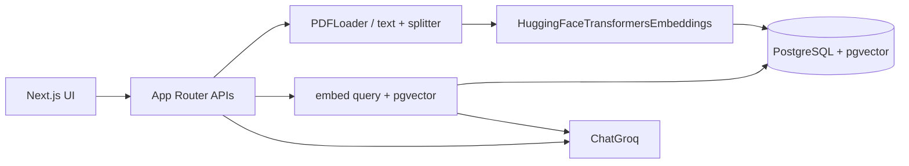

# Career Intelligence Assistant

MVP that compares **one resume** against **up to four job descriptions** using RAG.

Upload files, ask about fit / skill gaps / interview prep, or rank jobs with Best Match. Retrieved resume + job chunks are sent to Groq; the model must answer from that evidence only.

## Quick start

Prerequisites: Node.js 20+, npm, Docker Compose.

```bash
cp .env.example .env          # set GROQ_API_KEY for Analyze / Best Match
docker compose up -d
npm install
npm run db:migrate
npm run dev                   # http://localhost:3000
```

Retrieval and embeddings work without Groq. Generation needs `GROQ_API_KEY`.

```bash
npm run eval                  # seeds golden PDFs, scores 5 metrics, then clears them
```

## How it works



1. **Upload** — parse PDF/text, split with `RecursiveCharacterTextSplitter` (900/120), embed with local `Xenova/all-MiniLM-L6-v2`, store in Postgres.
2. **Ask** — embed the question, cosine-search resume chunks plus the selected job (or all jobs), then `ChatGroq` returns JSON. Citations come from retrieved chunks, not from the model.
3. **Best Match** — same retrieve + generate per job; TypeScript applies fixed weights (technical 40%, experience 30%, domain 20%, seniority 10%).

## Why these libraries

| Piece | Library | Why |
|---|---|---|
| PDF / text load | LangChain `PDFLoader` | No custom PDF parser |
| Chunking | `RecursiveCharacterTextSplitter` | Paragraph/line splits with overlap |
| Embeddings | `HuggingFaceTransformersEmbeddings` | Local 384-d MiniLM, no embedding API |
| Vectors | PostgreSQL + pgvector | Job slots, FKs, and `<=>` cosine search in one DB |
| LLM | `ChatGroq` (`openai/gpt-oss-120b`) | Fast hosted generation, JSON mode |

Job filters run in the same SQL as vector search so a Job 2 question cannot return Job 1 chunks.

## Project layout

```
src/app/api                 HTTP routes
src/components              CareerWorkspace + workspace/* UI pieces
src/rag                     ingest + embed
src/generation              ChatGroq, prompts, JSON parse
src/services                upload, retrieve, analyze, best match
src/db                      pool.ts, queries.ts, migrations/
evaluation/                 golden PDFs + 5-metric eval runner
```

## Evaluation

`npm run eval` uploads the golden PDFs (1 resume + 2 JDs), runs 20 labeled questions through the real retrieve + Ask path, then deletes that data. Needs `DATABASE_URL`. Generation metrics also need `GROQ_API_KEY`.

| Kind | Metric | Meaning |
|---|---|---|
| Retrieval | Precision@5 | Of the chunks we returned, how many were the right source? |
| Retrieval | Recall@5 | Of the relevant chunks that could fit in top-5, how many did we get? |
| Generation | Faithfulness | How much of the answer appears in the retrieved chunks? |
| Generation | Answer relevance | How much of the question is covered by the answer? |
| Generation | Answer correctness | How much of the written gold answer is covered by the answer? |

Retrieval is labeled (document type + job). Generation is word overlap against retrieved text, the question, and `evaluation/golden.json` reference answers. This is a small assignment check, not a production RAGAS benchmark.

Golden files: `evaluation/fixtures/resume.pdf`, `job-1.pdf` (MERN / Veritech.ai), `job-2.pdf` (Staff Software Engineer FDE).

Last run (top-5, MiniLM, real Ask path):

| Metric | Value |
|---|---|
| Precision@5 | 0.667 |
| Recall@5 | 0.667 |
| Faithfulness | 0.696 |
| Answer relevance | 0.654 |
| Answer correctness | 0.578 |

## Out of scope

Auth, multi-user, object storage, hybrid search, reranking, HNSW, streaming, unit test suite, LLM-as-judge evaluation.
