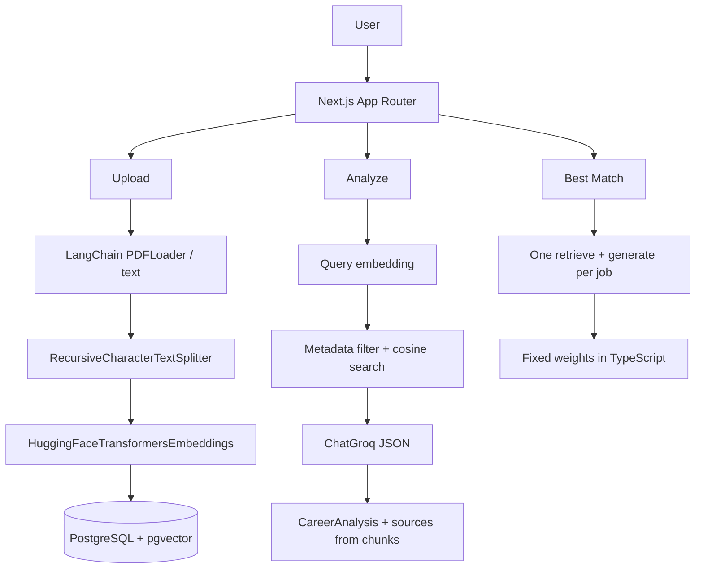

# Architecture

Single-user Next.js App Router MVP. PostgreSQL + pgvector is the only datastore. Evaluation lives outside `src/` and is not imported by the app.

## Layers

- **UI** (`src/app`, `src/components`): `CareerWorkspace` holds fetch/state. Documents, analysis form, and results are separate components. The UI does not import database or RAG modules.
- **API** (`src/app/api`): health, resume, jobs, clear, analyze, best-match. Handlers call services.
- **Services** (`src/services`): upload/ingest, retrieval, career analysis + best match.
- **RAG** (`src/rag`): LangChain `PDFLoader` / text load, `RecursiveCharacterTextSplitter`, `HuggingFaceTransformersEmbeddings`.
- **Generation** (`src/generation`): `ChatGroq`, grounded prompts, JSON parsers, best-match weights.
- **Database** (`src/db`): `pool.ts` (connection), `queries.ts` (all SQL), `migrations/` (schema). Vector search uses `<=>` in SQL.

Postgres 16 + pgvector runs in Docker Compose.

## Domain model

```
resumes  1 ──< documents  1 ──< document_chunks
jobs     1 ──< documents  1 ──< document_chunks
```

A document belongs to exactly one resume **or** one job. Chunk `job_id` / `document_type` are copied from the parent document by a trigger so retrieval can filter Job 1–4 without a join. `jobs.slot` (1–4) is the stable identity.

Schema: `npm run db:migrate`. No ANN index (corpus is small).

## Request flows



## Not in this MVP

Auth, multi-tenancy, object storage, workers, HNSW, hybrid search, reranking, streaming, chat history, rate limits.
