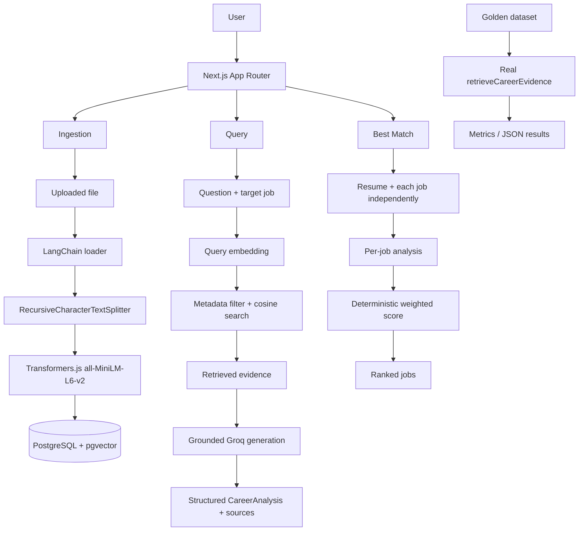

# Architecture

Career Intelligence Assistant is a single-user Next.js App Router app. PostgreSQL + pgvector is the only datastore. Evaluation code lives outside `src/` and is not imported by the application.

The README is the full technical write-up. This file is the layer map, domain model, and request-flow diagram.

## Layers

- **UI** (`src/app`, `src/components`): `CareerWorkspace` is a client component. It calls API routes with `fetch`. It does not import database, RAG, or generation modules.
- **API routes** (`src/app/api`): `GET /api/health`, `GET/POST/DELETE /api/resume`, `GET /api/jobs`, `POST/DELETE /api/jobs/:slot`, `POST /api/clear`, `POST /api/analyze`, `POST /api/best-match`. Handlers call services. They do not contain SQL or prompt text.
- **Configuration** (`src/lib/config.ts`): `DATABASE_URL` for the server-side pool.
- **Database** (`src/db`): pool, SQL migrations, row types, repositories. `document-chunks.ts` owns `<=>` search. No embedding code here.
- **Domain types** (`src/types/domain.ts`): Resume, Job, Document, DocumentChunk, `JobSlot`.
- **RAG ingestion** (`src/rag`): PDF/text loaders, normalization, `RecursiveCharacterTextSplitter`, chunk metadata.
- **RAG embedding** (`src/rag/embedding`): `EmbeddingProvider` + local Transformers.js `Xenova/all-MiniLM-L6-v2` (384-d, mean pool, L2 normalize). In-memory vectors only.
- **Generation** (`src/generation`): `AnalysisLLMProvider` + Groq chat-completions client, grounded prompts, JSON parsers, best-match weights. No SQL.
- **Services** (`src/services`): `ingestUploadedDocument`, `persistIngestedChunks`, `document-management`, `retrieveCareerEvidence`, `analyzeCareerFit`, `findBestMatch`.
- **Evaluation** (`evaluation/`): golden questions, metric functions, harness, retrieval runner, chunking experiment. Calls the real retriever. Never imported from `src/`.

PostgreSQL 16 + pgvector runs in Docker Compose. There is no hosted database dependency.

## Domain model

```
resumes 1 ──< documents 1 ──< document_chunks
jobs    1 ──< documents 1 ──< document_chunks
```

A document belongs to exactly one resume **or** one job. `document_chunks.job_id` and `document_type` are copied from `documents` by a trigger so retrieval can filter Job 1–4 or all jobs without a join.

`jobs.slot` is the stable identity (`1`–`4`). Replacing a file does not change the job id.

Schema: `npm run db:migrate`. No vector ANN index is created.

## Request flows



## What is not in this architecture

Authentication, multi-user tenancy, object storage, ingestion workers, queues, HNSW, hybrid search, reranking, query expansion, streaming, chat history, rate limiting, retries, and hosted tracing are not implemented. They are listed as future productionization work in the README, not as current components.
